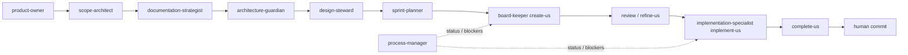

# Agent roster e workflow v11 — gap analysis e redesign

> **Status:** proposta — jul/2026  
> **Contexto:** markdown audit (onda G) alinha texto; esta onda (H) alinha **quem faz o quê** e remove sobrecarga do `process-manager`.  
> **Relacionado:** `markdown-audit-v11.md`, `kit-improvement-plan.md`

---

## 1. Problema hoje

| Sintoma | Causa |
| ------- | ----- |
| `/implement-us` mistura governança e código | `process-manager` faz gate **e** implementação |
| UI/design sem dono no protocolo | `04_principles` cita tokens; ninguém mantém referência viva |
| `documentation-strategist` faz epics + fase 01–10 | papel amplo demais |
| `board-keeper` vs `process-manager` | fronteira US-doc vs gate/implement confusa |
| 8 agentes, routing na matriz | falta especialista de execução e de design |

**Visão:** cada agente = **um tipo de decisão**. Governança não escreve produto; implementador não redefine escopo.

---

## 2. Roster atual (8)

| Agente | Foco | Sobrecarga? |
| ------ | ---- | ----------- |
| `process-manager` | Status, gates, **implement US**, init | ⚠️ implement deve sair |
| `board-keeper` | US create/review/refine/close | OK |
| `sprint-planner` | Version, sprint | OK |
| `documentation-strategist` | Phase docs + epic create | ⚠️ epic pode ficar; fase OK |
| `scope-architect` | `00_scope.md` | OK |
| `architecture-guardian` | `05_architecture.md` + `docs/architecture/` | OK |
| `security-steward` | `02_security.md` | OK |
| `product-owner` | Discovery, product brief | OK |

---

## 3. Agentes propostos (novos)

### 3.1 `implementation-specialist` (ou `us-implementer`)

**Por quê:** `/implement-us` é o único momento em que agente **escreve código de produto**. Hoje `process-manager` faz isso — conflito com papel de “manager”.

| Item | Definição |
| ---- | --------- |
| **Missão** | Passar gate, implementar US com `ready: true`, respeitar Plan/Architecture refs, não fechar US |
| **Workflow** | `/implement-us` |
| **Skills** | `implement-user-story`, `meridian-routing` (leitura) |
| **Proibições** | Criar US, alterar escopo, `complete-us`, pular gate, código sem US |
| **Gate** | `meridian_db_cli implement-gate` exit 0 antes de qualquer Write em `src/` |

**Handoff:**

```txt
board-keeper (/refine-us, ready: true)
  → implementation-specialist (/implement-us)
  → board-keeper (/complete-us) + human commit
```

`process-manager` **valida** que o fluxo foi seguido em `/status` e `/daily-with-ai` — não implementa.

### 3.2 `design-steward`

**Por quê:** stack dogfood usa React + Tailwind + shadcn (`docs/01_tech_stack.md`). US de UI precisam de referência estável — tokens, componentes, padrões responsivos — sem duplicar em cada US.

| Item | Definição |
| ---- | --------- |
| **Missão** | Criar e evoluir **referência de design** alinhada à linguagem escolhida; revisar/refinar quando US ou epic toca UI |
| **Artefato canônico** | `docs/09_design_system.md` (novo phase doc) + opcional `docs/design-system/*.md` (detalhe) |
| **Skills** | `refine-design-system` (novo), `update-decisions-log`, `meridian-routing` |
| **Workflows** | `/design-pass` (novo), invocado em `/refine-us` quando Acceptance menciona UI |
| **Proibições** | Implementar feature completa; substituir `05_architecture`; inventar stack fora de `01_tech_stack` |

**Gate:** US com critérios visuais deve citar `docs/09_design_system.md` em Plan → Architecture refs (ou seção Design refs).

**Relação com outros:**

| Agente | Divisão |
| ------ | ------- |
| `architecture-guardian` | estrutura, apps, integrações |
| `design-steward` | superfície, tokens, componentes, a11y/responsive |
| `implementation-specialist` | código seguindo ambos |

---

## 4. Outros gaps (avaliar — não bloquear H1)

| Candidato | Quando criar | Por quê não agora |
| --------- | ------------ | ----------------- |
| `test-engineer` | Muitas US com `tests: required` e falhas recorrentes | gate + checklist cobrem MVP |
| `devops-steward` | Deploy/go-live vira epic recorrente | `08_environments` + human |
| `database-architect` | Projetos com schema complexo fora do kit | `06_database` + architecture-guardian |
| Renomear `documentation-strategist` → `phase-docs-strategist` | Após H1 | só naming; baixo ROI |

**Recomendação v11:** criar só **implementation-specialist** + **design-steward**; revisar em 1 sprint.

---

## 5. Roster alvo (10 agentes)

```txt
Discovery     product-owner
Scope         scope-architect
Phase docs    documentation-strategist
Security      security-steward
Architecture  architecture-guardian
Design        design-steward          ← NEW
Planning      sprint-planner
US lifecycle  board-keeper
Implement     implementation-specialist ← NEW
Governance    process-manager         (sem código)
```

---

## 6. Redesign de workflow

### 6.1 Fluxo US (v11)



### 6.2 Comandos slash

| Comando | Agente (novo) | Notas |
| ------- | ------------- | ----- |
| `/implement-us` | `implementation-specialist` | era `process-manager` |
| `/design-pass` | `design-steward` | novo — opcional antes de refine UI |
| `/status`, `/daily-with-ai` | `process-manager` | sem mudança |
| Demais delivery | `board-keeper` / `sprint-planner` | sem mudança |

### 6.3 Redundâncias a remover (onda H + G)

| Redundância | Ação |
| ----------- | ---- |
| `process-manager` implementa código | Mover para `implementation-specialist`; PM só gate-check em status |
| Epic em `documentation-strategist` e `create-epic` skill | Manter skill; agente pode ser `documentation-strategist` ou `board-keeper` — **decidir H2** |
| Templates duplicados skill `references/` vs `references/templates/` | `TEMPLATE_SOURCES.md` já mapeia — audit G2 confirma single edit path |
| `instruction-surfaces.md` app-desktop | Remover camada morta (G1) |
| `meridian-routing` matrix desatualizada | Atualizar na onda H1 |

---

## 7. Onda H — entregáveis (checklist)

### H1 — Agentes core (par com G1–G3)

- [ ] `.agent/agents/implementation-specialist.md`
- [ ] `.agent/agents/design-steward.md`
- [ ] `.agent/skills/design-system/SKILL.md` + `references/design-system-template.md`
- [ ] `.agent/workflows/design-pass.md`
- [ ] `docs/09_design_system.md` stub no dogfood (ou seção em `04_principles` até aprovado — preferir 09)
- [ ] Atualizar `meridian-routing/SKILL.md` matrix
- [ ] Atualizar `process-manager.md` — remover implement; delegar
- [ ] Atualizar `workflows/implement-us.md` → `implementation-specialist`
- [ ] Atualizar `rules/MERIDIAN.md`, `agents-help.md`, `ARCHITECTURE.md`, `INDEX.md`
- [ ] `sync_cursor_kit.sh` + `.codex/agents/*.toml` gerados

### H2 — Workflow e redundância

- [ ] Revisar epic owner (`documentation-strategist` vs dedicado)
- [ ] Unificar narrativa `board-keeper` / `implementation-specialist` / `process-manager` em `lifecycle.md`
- [ ] Adicionar `design-pass` opcional em `refine-us` workflow quando UI
- [ ] Validator: US com keywords UI sem ref design → warning

### H3 — Guardrail

- [ ] Routing test: “implement US-XXXX” → `implementation-specialist`, não PM
- [ ] Documentar em `instruction-surfaces.md` checklist para novo agente

---

## 8. Integração com audit markdown (onda G)

Ao revisar cada arquivo em `markdown-audit-v11.md` §7:

1. Substituir `process-manager` + implement → `implementation-specialist` onde for **execução de código**
2. Manter `process-manager` para status, governança, init, daily
3. Inserir `design-steward` onde houver UI, tokens, Tailwind, responsive
4. Adicionar `docs/09_design_system.md` na árvore em `start-here.md` (G1)
5. Marcar checkboxes H1 em paralelo aos checkboxes G3 (agents/workflows)

**Ordem sugerida:**

```txt
Commit planos (G audit + H roster)
  → G1 P0 markdown (rules, lifecycle, start-here, instruction-surfaces, docs/README)
  → H1 skeleton agents + routing + implement-us workflow
  → G2–G3 restante com vocabulário já incluindo novos agentes
```

---

## 9. Perguntas abertas (manager)

1. Nome final: `implementation-specialist` vs `us-implementer` vs `delivery-engineer`?
2. `09_design_system.md` como phase doc com gate `approved` antes de UI US Must?
3. `/design-pass` obrigatório ou só quando Acceptance menciona UI?
4. Epic continua com `documentation-strategist`?

---

*Documento vivo — fechar perguntas §9 antes de H1 Write nos agent files.*
