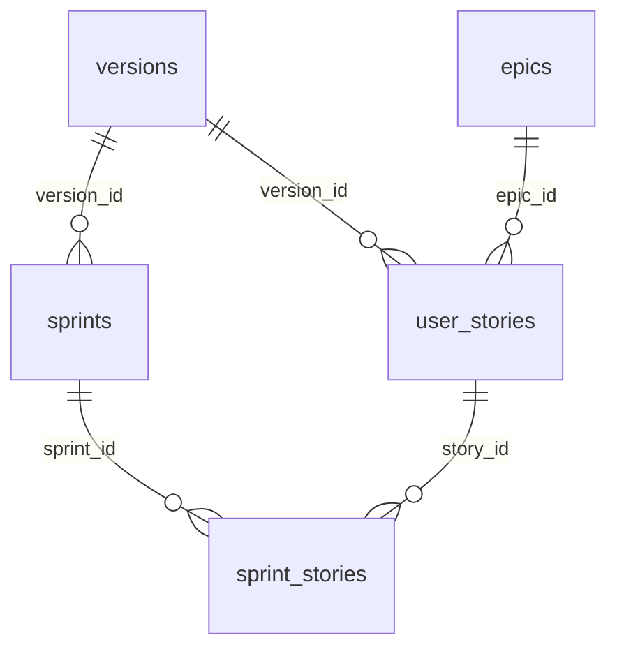

# SQLite delivery operations — agent reference

> **Read this before INSERT/UPDATE on `.meridian/meridian.db`.** Prefer kit CLI (`meridian_db_cli.py`) over raw SQL. Phase docs (`00`–`11`) stay Markdown — never store them in SQLite.

## Location

| Item | Path |
| ---- | ---- |
| Database | `{packageRoot}/.meridian/meridian.db` |
| Migrations | `.agent/migrations/YYYYMMDDHHMMSS_*.sql` |
| Access layer | `.agent/scripts/meridian_db.py` |
| CLI | `.agent/scripts/meridian_db_cli.py` |

Dogfood `packageRoot` = repository root (`.`).

## Relational model (insert order matters)

```txt
1. versions          (no FK)
2. epics             (no FK; versions field is text JSON list)
3. user_stories      (FK: epic_id → epics.id, version_id → versions.id)
4. sprints           (FK: version_id → versions.id)
5. sprint_stories    (FK: sprint_id → sprints.id, story_id → user_stories.id)
6. decisions         (independent)
7. board_snapshots   (derived; use generate_board.py)
```

**FK failures** mean parent row missing — insert version and epic before user story; insert user stories before `sprint_stories`.



## Agent workflow (summary-first)

```bash
# 1. Bootstrap / migrate
python3 .agent/scripts/bootstrap_meridian_db.py .
python3 .agent/scripts/migrate_md_to_sqlite.py .   # one-time if legacy .md exist

# 2. Discover (no full bodies)
python3 .agent/scripts/meridian_db_cli.py counts .
python3 .agent/scripts/meridian_db_cli.py list user_stories --version v10 --status ❌
python3 .agent/scripts/meridian_db_cli.py search "parity" --entity user_stories

# 3. Read summary, then full only if implementing
python3 .agent/scripts/meridian_db_cli.py show US-0115
python3 .agent/scripts/meridian_db_cli.py show US-0115 --full

# 4. Write (never create docs/us/*.md when DB exists)
python3 .agent/scripts/meridian_db_cli.py create-us --title "..." --epic EPIC-15 --version v10
python3 .agent/scripts/meridian_db_cli.py update-us US-0115 --from-file /tmp/us.md
python3 .agent/scripts/meridian_db_cli.py set-ready US-0115 --ready true
python3 .agent/scripts/meridian_db_cli.py set-summary US-0115 --text "4-8 sentence summary"

# 5. Board + validate
python3 .agent/scripts/generate_board.py .
python3 .agent/scripts/validate_meridian.py .
python3 .agent/scripts/validate_meridian.py . --sqlite-only   # after purge
```

## Inspect without CLI (sqlite3)

```bash
sqlite3 .meridian/meridian.db "SELECT id, title, status, ready, summary FROM user_stories WHERE version_id='v10' ORDER BY id;"
sqlite3 .meridian/meridian.db "SELECT ss.sprint_id, ss.story_id, ss.position FROM sprint_stories ss JOIN sprints s ON s.id=ss.sprint_id WHERE s.version_id='v10';"
sqlite3 .meridian/meridian.db "PRAGMA foreign_key_list(user_stories);"
```

## Upsert patterns (use meridian_db.py — do not duplicate)

| Entity | Function | Notes |
| ------ | -------- | ----- |
| Version | `upsert_version(conn, fm, body, sections)` | `sections` from `extract_version_sections` |
| Epic | `upsert_epic(conn, fm, body, sections)` | |
| User story | `upsert_user_story(conn, fm, body, sections, depends_on)` | `depends_on` is `list[str]` |
| Sprint | `upsert_sprint(conn, fm, body, sections, stories)` | `stories` rebuilds `sprint_stories` |

`body` = full markdown with YAML frontmatter. Section columns (`intent_why`, `plan_approach`, …) are extracted by `meridian_markdown_parse.py`.

## Verification and purge

```bash
python3 .agent/scripts/verify_md_sqlite_parity.py .          # exit 0 = safe to purge
python3 .agent/scripts/backfill_summaries.py .                 # fill NULL summaries
python3 .agent/scripts/purge_delivery_md.py . --dry-run
python3 .agent/scripts/purge_delivery_md.py . --require-verify
```

## Forbidden when `--sqlite-only` is active

- `Write` on `docs/us/`, `docs/epics/`, `docs/versions/`, `docs/sprints/`, `docs/decisions/*.json`
- Creating delivery `.md` “for convenience” — use CLI upsert only

## Templates for narrative structure

| Artifact | Markdown shape template |
| -------- | ----------------------- |
| User story | `.agent/skills/create-user-story/references/us-template.md` |
| Epic | `.agent/skills/create-epic/references/epic-template.md` |
| Version | `.agent/skills/create-version/references/version-template.md` |
| Sprint | `.agent/skills/create-sprint/references/sprint-template.md` |

Parse → upsert via CLI; do not hand-edit SQL for narrative bodies unless emergency.
