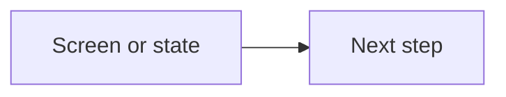

# Feature interaction flow file template

Path: `docs/architecture/diagrams/feature-{slug}.md`

```markdown
---
title: {Human title}
kind: feature-interaction
us: US-XXXX
epic: EPIC-XX
surface: web | app | extension
updated: YYYY-MM-DD
---

# {Human title}

One paragraph: what job this flow serves and when it runs.

## Diagram



## States

| State | User sees | Recovery |
| ----- | --------- | -------- |
| empty | | |
| error | | |
| loading | | |

## Implementation mapping

| Node (diagram) | Code evidence (path or symbol) |
| -------------- | ------------------------------ |
| | |

## Related

- `09` § Screen flows — row `{Flow name}`
- US Plan — `US-XXXX`
```

One mermaid block per file. Add index row in `docs/05_architecture.md` § Architecture diagrams.
