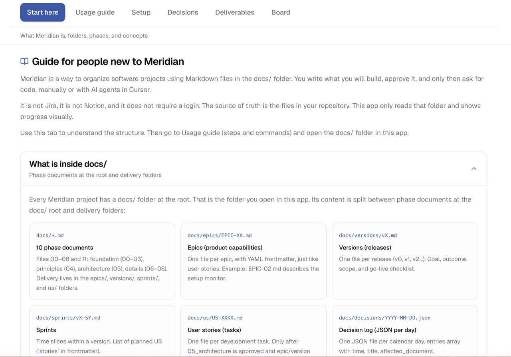
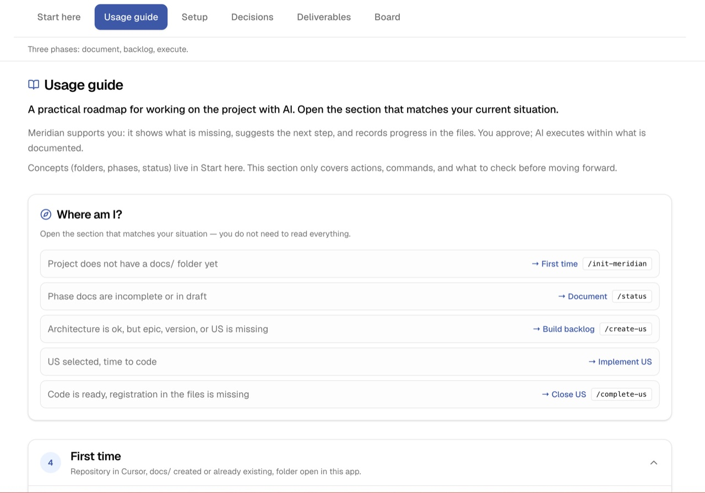
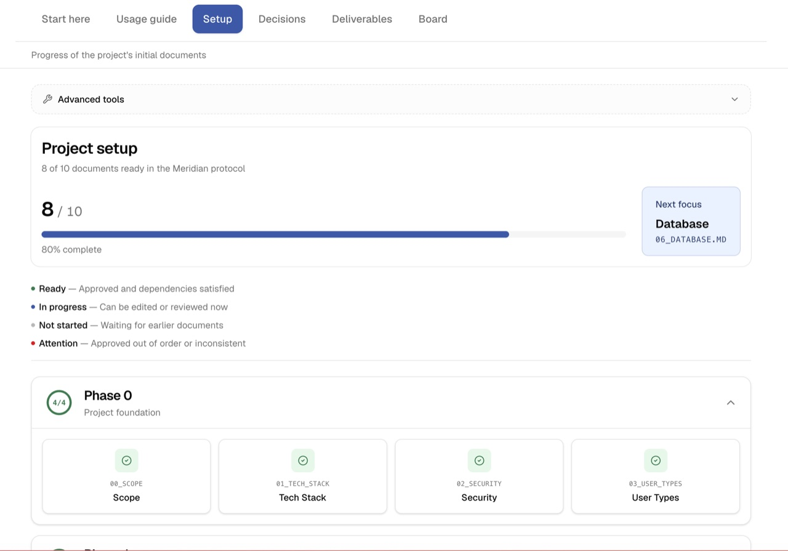
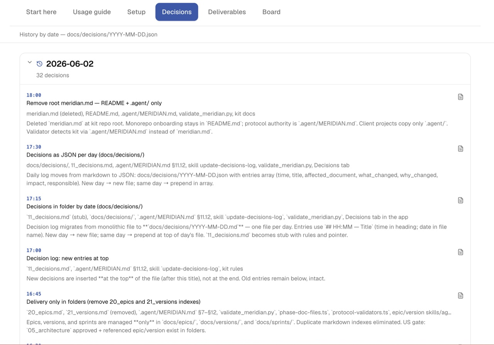
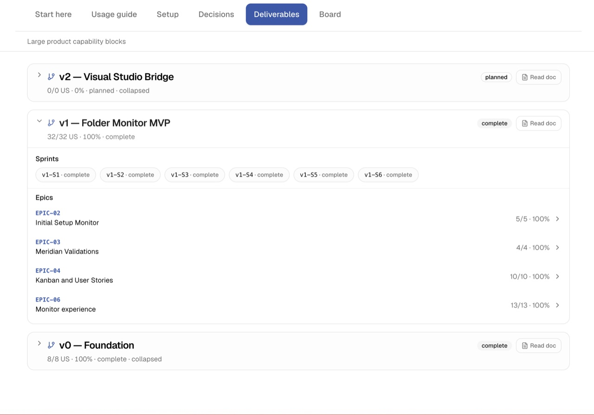
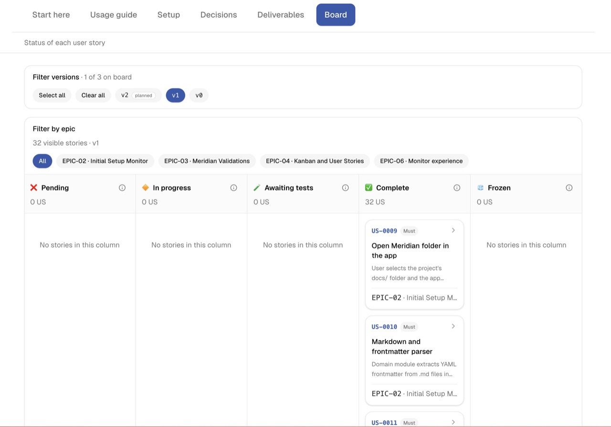
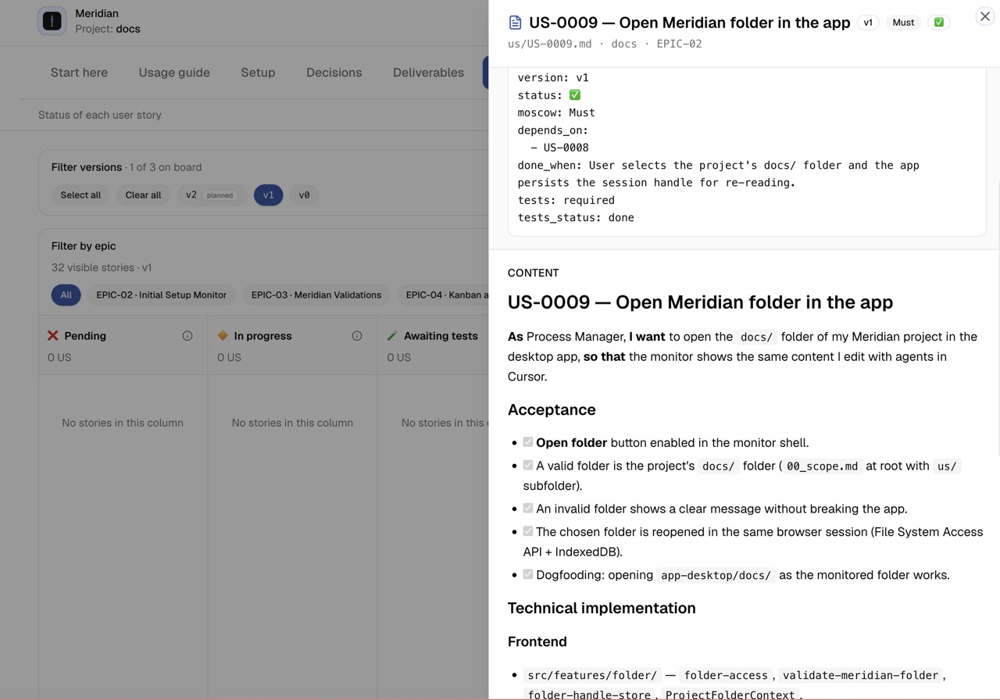

<p align="center">
  
</p>

<p align="center">
  <a href="LICENSE"></a>
  <a href=".github/workflows/ci.yml"></a>
  
</p>

<p align="center">
  <strong>Your repo documents what you are building.</strong><br />
  AI agents read the same files — so “done” means done in Git, not done in chat.
</p>

<!-- GitHub About → Settings → Description: -->
<!-- Docs-first protocol: structure your app in Git, work with AI from user stories and acceptance in files. -->

> **Very early experiment** — personal project; APIs and rules will change. [Roadmap](#roadmap) · [Protocol](.agent/MERIDIAN.md)

# Meridian

**Set the meridian before you write code.**

## The problem

With AI in the IDE, code appears quickly — but the **project** often does not: decisions stay in chat, scope drifts, and “it’s done” means the model said so five messages ago. A week later you (or the next session) cannot reliably answer:

- What are we building, and what is explicitly out of scope?
- What did we change last Tuesday, and why?
- Which user story is next, and what counts as finished?

Meridian treats that gap as a **documentation problem**, not a tooling problem.

## What Meridian gives you

One place in your repository — the `docs/` folder — to **structure the application** and **run work with AI** without losing continuity:

| You get | What it means in practice |
| ------- | ------------------------- |
| **Ordered product docs** | Scope, stack, security, principles, architecture (`00`–`08`, `11`) — each step unlocks the next so you do not code on vibes alone. |
| **User stories with acceptance** | Work lives in `docs/us/` with Why / Where / Approach, checkable criteria, and `ready: true` before code; “done” is recorded in the file (`/complete-us`), not implied by a green checkmark in the chat. |
| **A decision trail** | `docs/decisions/` captures *why* something changed — for you on Monday and for the agent on Tuesday. |
| **Agents on rails** | `.agent/` supplies workflows, skills, and gates so the IDE does not reinvent the process every prompt. |
| **Visible progress (optional)** | The desktop monitor reads `docs/` and shows setup, backlog, board, and story detail — read-only, no second source of truth. |

**Docs-first** (documentation-driven) development: the spec lives in Git next to the code. User stories and acceptance criteria follow familiar agile ideas; Meridian is not Scrum-in-a-box and not Jira — it is a **file protocol** for one repo, one truth, AI included.

**You** stay manager: agents propose and implement; you approve documents, scope, and ✅ with evidence.

**Guides:** [Start here](.agent/references/start-here.md) (concepts) · [Usage guide](.agent/references/usage-guide.md) (commands and daily flow).

## Two pieces in every Meridian project

| Piece | Role |
| ----- | ---- |
| **`docs/`** | What is true about the product — if it is not here, it is not part of the process. |
| **`.agent/`** | How AI sessions run — slash workflows, agents, skills, rules (copy this kit into your repo). |

Code implements `docs/`. Agents follow `.agent/`. Chat is where work happens; **files are what persist.**

## What is in this repository

| Piece | Required? | What it does |
| ----- | --------- | ------------ |
| [`.agent/`](.agent/) + [protocol](.agent/MERIDIAN.md) | **Yes** | Defines the Meridian flow: agents, workflows (`/status`, `/complete-us`, …), skills, and always-on rules. **Copy into every Meridian project.** |
| `docs/` (in *your* project) | **Yes** | Project documentation the agents read and update — not shipped inside this kit repo except as a [dogfooding example](app-desktop/docs/). |
| `.cursor/` | Cursor only | Local mirror of `.agent/` ([adapter](.agent/CURSOR_ADAPTER.md)). Symlinks, not committed. |
| [`app-desktop/`](app-desktop/) | **No** | Optional **visual tracker** (browser): read a `docs/` folder and see setup, deliverables, decisions, and kanban. Does not replace `.agent/` or your IDE. |

## IDE support

Meridian is **not tied to Cursor**. The kit lives in `.agent/` (Antigravity / ag-kit convention). Any IDE that reads `.agent/` can use it as-is.

| IDE / tool | How you use Meridian |
| ---------- | ------------------- |
| **Antigravity, ag-kit, others** | Point the IDE at `.agent/` — workflows, agents, and skills work natively. |
| **Cursor** | Cursor does not index `.agent/` by default. Run `./.agent/scripts/sync_cursor_kit.sh` to build a **local** `.cursor/` folder (rules, skills, agents, slash commands). Still edit the kit in `.agent/`; regenerate symlinks after clone or kit changes. |

```txt
.agent/          ← source of truth (commit this)
.cursor/         ← Cursor adapter only (gitignored, symlinks → .agent/)
```

Details: [`.agent/CURSOR_ADAPTER.md`](.agent/CURSOR_ADAPTER.md)

## How it works

1. **Document** — Phase docs (`00_scope` … `05_architecture`, security, stack, …) and `docs/decisions/` for why things changed.
2. **Plan** — Epics, versions, sprints, and user stories after architecture is approved enough to commit.
3. **Refine** — `/refine-us` deepens Approach and sets `ready: true` before any product code.
4. **Execute** — Work from a US file; record evidence; `/complete-us` when it is really done.

**Rule of thumb:** if it is not in `docs/`, it is not part of the managed process — chat does not count.

No login. No cloud. Git holds the history. Agents follow `.agent/`; the desktop monitor, if you use it, only **reads** `docs/`.

## What it is not

- Not a PM SaaS, not a wiki you forget to update, not vibe-coding without a spec.
- Not “the agent said done” — done is in `docs/us/` with acceptance and implementation recorded.
- Not the monitor running the project — the IDE + `.agent/` + `docs/` do; the app only displays files.

## Quick start

```bash
git clone https://github.com/colabcolibri/meridian.git
cd meridian

# Cursor only — mirror .agent/ into .cursor/ (local, not committed):
chmod +x .agent/scripts/sync_cursor_kit.sh
./.agent/scripts/sync_cursor_kit.sh

# Optional — desktop monitor:
cd app-desktop && pnpm install && pnpm dev
```

If your IDE already supports `.agent/`, skip the sync script and open the repo there.

**New to Meridian?** [Start here](.agent/references/start-here.md) → [Usage guide](.agent/references/usage-guide.md) → `/init-meridian` or `/status`.

To try the optional monitor locally:

1. `cd app-desktop && pnpm install && pnpm dev`
2. Open **http://localhost:5173** (Chrome or Edge on localhost for folder access)
3. Click **Open docs folder** and select a Meridian `docs/` directory (e.g. `app-desktop/docs/` in this repo)

## Desktop monitor (optional)

The **real Meridian loop runs in your IDE** through `.agent/` — workflows, agents, and slash commands. The desktop app does **not** replace that; it is a **read-only window** on the same Markdown and JSON you already commit in `docs/`. Use it when you want a quick visual answer: *what is approved, what is blocked, which US is Must, what changed yesterday*.

Same guides as the first two tabs also exist as Markdown: [start-here.md](.agent/references/start-here.md) · [usage-guide.md](.agent/references/usage-guide.md).

| Tab | What you see | When it helps |
| --- | ------------ | ------------- |
| [Start here](#start-here-tab) | Concepts, `docs/` map, phases | Onboarding yourself or someone else |
| [Usage guide](#usage-guide-tab) | Daily paths and slash commands | Choosing the next command in a session |
| [Setup](#setup-tab) | Phase docs 00–11 and gates | Knowing which doc unlocks the next |
| [Decisions](#decisions-tab) | `docs/decisions/*.json` by day | Auditing *why* scope or stack changed |
| [Deliverables](#deliverables-tab) | Versions, sprints, epics, coverage | Planning releases without opening every file |
| [Board](#board-tab) | Kanban from US frontmatter | Execution focus — what is ❌, 🔶, ✅, 🧪 |
| [Story detail](#story-detail-tab) | One US opened in full | Reviewing Acceptance and implementation evidence |

### Start here tab

Onboarding inside the app: what Meridian is, what lives under `docs/`, how phase documents chain into architecture, and how epics/versions/sprints/US relate. Mirrors [start-here.md](.agent/references/start-here.md) for reading in the IDE or on GitHub without running the app.

<p align="center">
  
</p>

### Usage guide tab

Action-oriented: *where am I?* → first time, document, build backlog, implement US, close US. Each block ties to slash commands (`/init-meridian`, `/status`, `/create-us`, `/complete-us`, …). Mirrors [usage-guide.md](.agent/references/usage-guide.md).

<p align="center">
  
</p>

### Setup tab

Reads your project's phase Markdown (`00_scope` through `08_environments`, `11_decisions`) and shows **draft**, **review**, or **approved** per file, plus what is still blocked. This is the visual gate before you create epics or user stories — architecture must be **approved** before backlog work is valid.

<p align="center">
  
</p>

### Decisions tab

Lists `docs/decisions/YYYY-MM-DD.json` files. Each day is one JSON file; new decisions are **prepended** to `entries` (newest first). You see title, rationale, and which documents were affected — the audit trail agents and humans should update when scope, stack, or security shifts.

<p align="center">
  
</p>

### Deliverables tab

Epic-centric planning view: each epic shows user story coverage; toggle **version** to filter which release you are planning. Versions and sprints still live in `docs/versions/` and `docs/sprints/` — use this tab to spot gaps before opening every file in `docs/epics/`.

<p align="center">
  
</p>

### Board tab

Kanban **generated from** `docs/us/*.md` frontmatter — not edited by hand in `board.json`. Columns reflect status (pending, in progress, waiting for tests, done, frozen). Filter by version and epic when the backlog grows.

<p align="center">
  
</p>

### Story detail tab

Drill-down on a single user story: narrative, **Acceptance** checkboxes, **Technical implementation** (required before ✅), and **Tests** when `tests: required`. What you verify here should match what `/complete-us` writes back to the file — chat alone is not enough.

<p align="center">
  
</p>

## Adopt Meridian in your project

You need **both** in the target repo:

```txt
your-project/
  .agent/          ← required: flows, agents, skills (copy from this kit)
  docs/            ← required: create via /init-meridian or init-project skill
```

```bash
cp -R path/to/meridian/.agent ./your-project/
```

1. Commit `.agent/` and grow `docs/` as the living project record.
2. **Antigravity / `.agent`-native IDE** — workflows and agents under `.agent/` drive the process.
3. **Cursor** — run `./.agent/scripts/sync_cursor_kit.sh` for slash commands in `.cursor/`; still edit the kit in `.agent/`. Do not commit `.cursor/`.
4. **Monitor (optional)** — run `app-desktop` locally if you want a visual read-only view of `docs/`.

## Agents and commands

| Where | Agents | Commands |
| ----- | ------ | -------- |
| `.agent/` (all IDEs) | `process-manager`, `scope-architect`, `documentation-strategist`, `security-steward`, `architecture-guardian`, `sprint-planner`, `board-keeper` | Workflows in `.agent/workflows/` (e.g. `init-meridian`, `status`, `complete-us`) |
| `.cursor/` (Cursor) | Same personas (symlinked) | Slash commands: `/init-meridian`, `/status`, `/create-us`, `/refine-us`, `/complete-us`, `/sync-board`, `/daily-with-ai`, … |

Full map: [`.agent/ARCHITECTURE.md`](.agent/ARCHITECTURE.md).

## Roadmap

| Version | Status | Focus |
| ------- | ------ | ----- |
| v0 Foundation | done | `.agent/` kit |
| v1 Folder monitor | done | Read real `docs/` in the browser |
| v2 VS Code bridge | active | Extension, disk writes — `v2-S1`…`v2-S4` |
| v3 Native desktop | planned | Tauri shell, bundled validate — `v3-S1`…`v3-S3` |
| v4 Authoring workflows | planned | Extension wizards, US closure — `v4-S1`…`v4-S3` |
| v5 Export and Git | planned | CSV, sprint report, GitHub link — `v5-S1`…`v5-S3` |
| v6 Shared workspace | planned | Vision / go-no-go only — no US until v5 done |

More detail: [`app-desktop/docs/README.md`](app-desktop/docs/README.md).

## Protocol authority

1. Your instruction  
2. [`.agent/MERIDIAN.md`](.agent/MERIDIAN.md)  
3. [`.agent/rules/MERIDIAN.md`](.agent/rules/MERIDIAN.md)  
4. Workflows → agents → skills  

## Validate locally

```bash
python3 .agent/scripts/validate_meridian.py app-desktop
python3 .agent/scripts/validate_meridian.py app-desktop --json   # CI / machine output
cd app-desktop && pnpm lint && pnpm test && pnpm build
```

## Contributing · license

[`CONTRIBUTING.md`](CONTRIBUTING.md) · [`SECURITY.md`](SECURITY.md) · [PolyForm Noncommercial 1.0.0](LICENSE)
