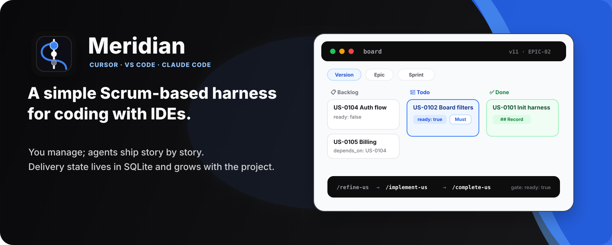
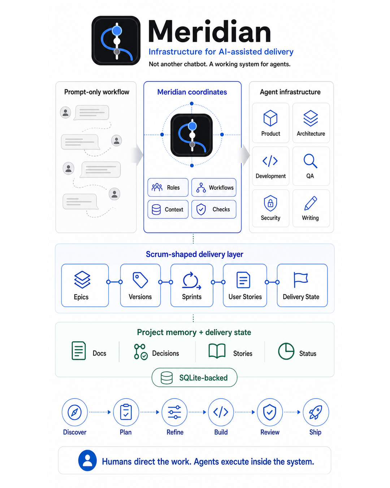
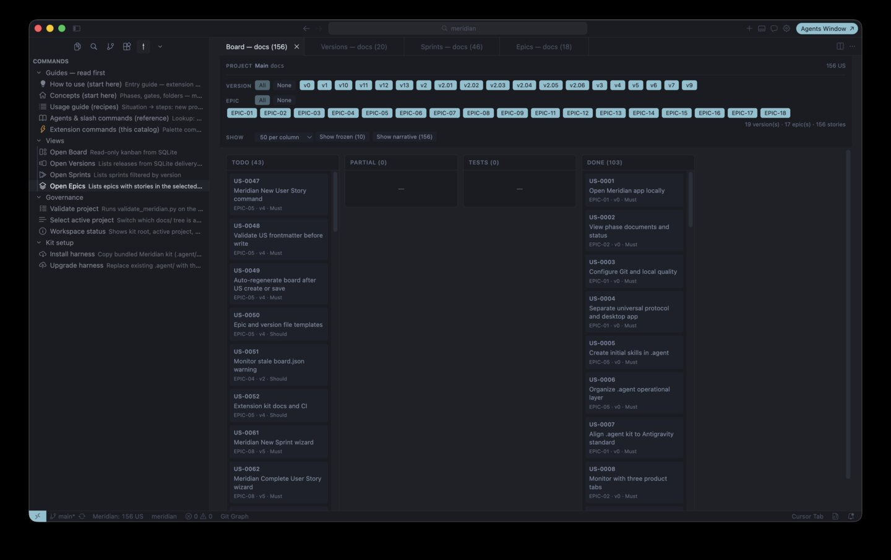
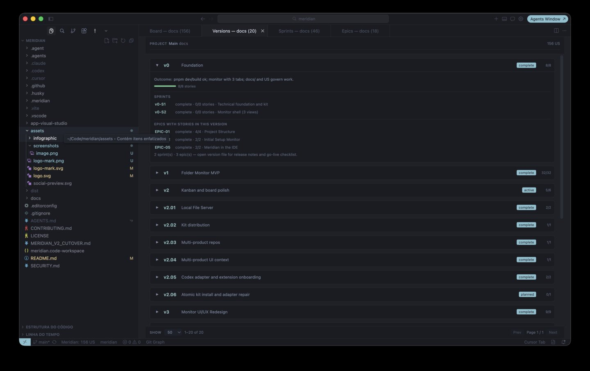
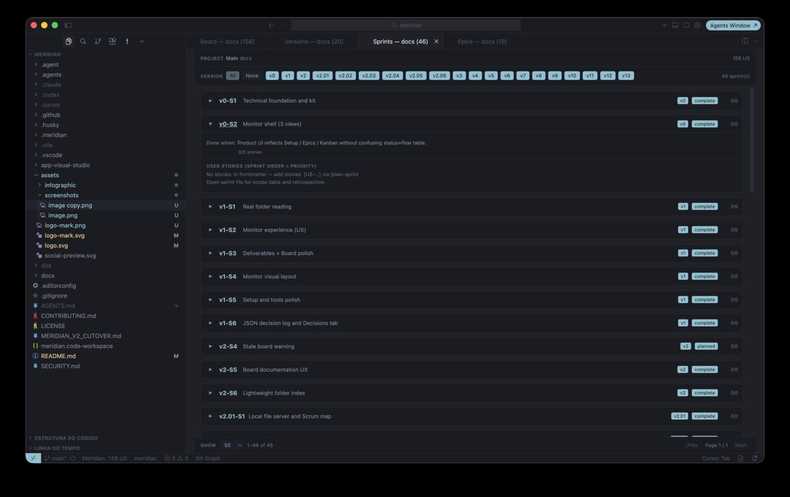
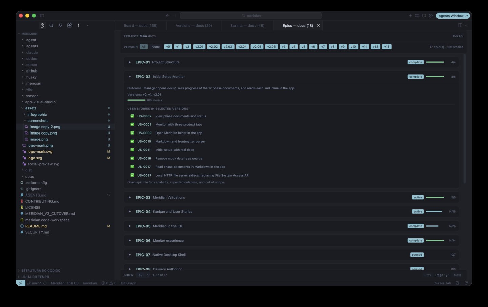
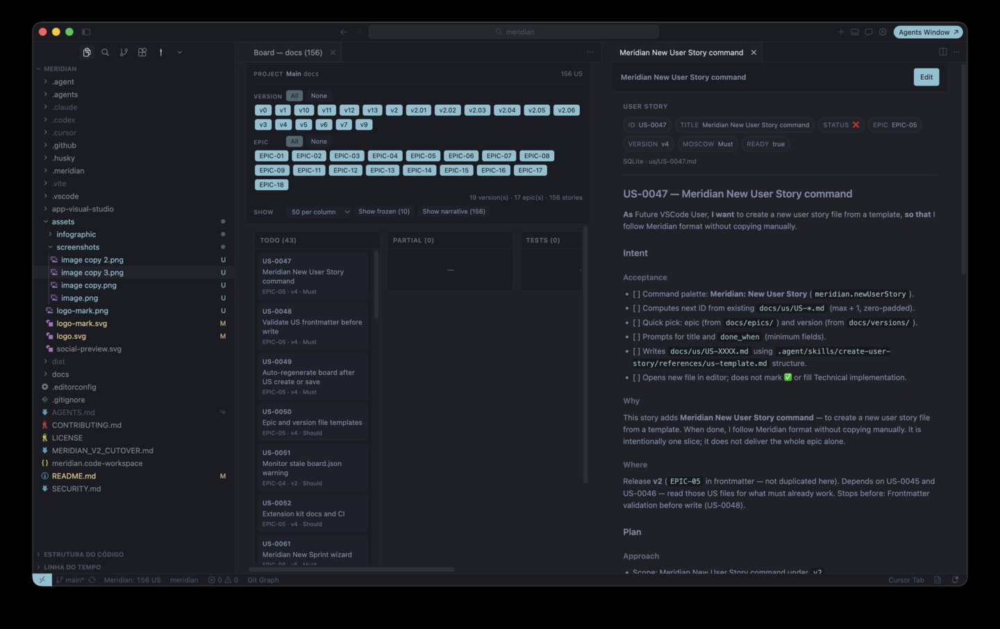
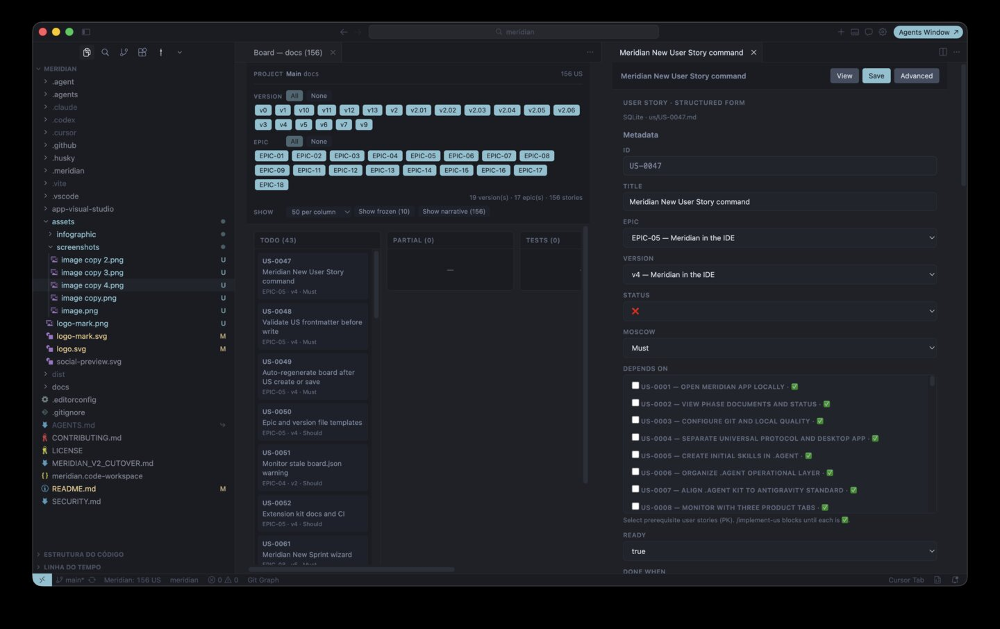

<p align="center">
  
</p>

<p align="center">
  <a href="LICENSE"></a>
  <a href=".github/workflows/ci.yml"></a>
  
</p>

<p align="center">
  <strong>You manage delivery. AI agents ship story by story.<br />
  The plan lives in the repo — not in yesterday's chat.</strong>
</p>

## What Meridian is

Meridian is a **harness for AI-assisted development in IDEs**. It wraps Cursor, VS Code, Claude Code, and Codex with:

- **Written intent** — scope, architecture, and security in `docs/` before backlog work
- **Structured delivery** — versions, sprints, epics, and user stories in `.meridian/meridian.db`
- **Agent discipline** — slash workflows, roles, skills, and validators in `.agent/`

You stay the manager. Agents execute **one user story at a time**, with gates so product code does not start on a vague prompt and “done” requires evidence.

## Extension or kit only?

| | **[Meridian Harness extension](app-visual-studio/)** | **Kit / CLI only** |
| - | ---------------------------------------------------- | ------------------- |
| Slash workflows (`/status`, `/create-us`, …) | ✅ | ✅ |
| Agents, skills, `.agent/` protocol | ✅ | ✅ |
| Delivery in SQLite + phase docs | ✅ | ✅ |
| Python toolkit (`meridian_delivery.py`, validate, export) | ✅ | ✅ |
| Board, planning views, dependency graphs | ✅ | ❌ |

**Recommended:** install [Meridian Harness](https://marketplace.visualstudio.com/items?itemName=colabcolibri.meridian-vscode) for the kanban board, graphs, and in-IDE guides.  
**Kit only:** copy or install `.agent/` into your project — same harness, no UI. Use `/status` and CLI export when you need visibility.

[How extension vs chat works →](.agent/references/how-to-use.md) · [Distribution →](.agent/DISTRIBUTION.md)

## Install (recommended)

1. Install [Meridian Harness](https://marketplace.visualstudio.com/items?itemName=colabcolibri.meridian-vscode) in VS Code or Cursor.
2. Open your project → **Meridian: Install Harness**.
3. In chat: **`/init-meridian`** (greenfield) or **`/document-project`** (brownfield).
4. **Meridian: Open Board** · anytime **`/status`**.

**Kit without extension:** see [`.agent/KIT_README.md`](.agent/KIT_README.md) or run `./install.sh` from a kit release.

**Developing Meridian itself:** clone this repo, `./.agent/scripts/sync_cursor_kit.sh`, then `cd app-visual-studio && pnpm install`.

## How it works

<p align="center">
  
</p>

```txt
document → plan → refine → implement → close → commit
```

| Step | What happens |
| ---- | ------------ |
| **Document** | You approve scope and architecture in `docs/` |
| **Plan** | Epics, versions, sprints, and stories land in SQLite |
| **Refine** | Story is concrete enough to build before any product code |
| **Implement** | Agent codes against acceptance criteria (`ready: true` required) |
| **Close** | Evidence on the story; you mark it done |
| **Commit** | One commit per closed story (recommended) |

Scrum-inspired for **one human directing AI agents** — no story points or velocity theater. [Scrum ↔ Meridian](.agent/references/scrum-meridian-map.md)

## Screenshots

<table>
  <tr>
    <td width="50%" valign="top">
      
      <p align="center"><sub><strong>Board</strong> — backlog, todo, status columns, filters</sub></p>
    </td>
    <td width="50%" valign="top">
      
      <p align="center"><sub><strong>Versions</strong> — release roadmap with sprints and epics</sub></p>
    </td>
  </tr>
  <tr>
    <td width="50%" valign="top">
      
      <p align="center"><sub><strong>Sprints</strong> — time-boxed goals</sub></p>
    </td>
    <td width="50%" valign="top">
      
      <p align="center"><sub><strong>Epics</strong> — capability blocks and progress</sub></p>
    </td>
  </tr>
  <tr>
    <td width="50%" valign="top">
      
      <p align="center"><sub><strong>User story</strong> — acceptance, plan, approach</sub></p>
    </td>
    <td width="50%" valign="top">
      
      <p align="center"><sub><strong>Edit story</strong> — form with dependencies</sub></p>
    </td>
  </tr>
</table>

## Why this exists

Agents ship code fast. Without a written plan, scope drifts in chat and every new session starts from zero.

Meridian is a lab for a thinner path: **you** own delivery; **agents** execute inside rules; state grows in the repo so the next session opens on the board, not on “let me explain the project again.”

## In this repository

| Piece | Role |
| ----- | ---- |
| [`.agent/`](.agent/) | Portable harness (workflows, agents, skills, Python toolkit) |
| [`docs/`](docs/) | Phase docs for Meridian itself (example project) |
| [`app-visual-studio/`](app-visual-studio/) | IDE extension — board, graphs, kit installer ([Marketplace](https://marketplace.visualstudio.com/items?itemName=colabcolibri.meridian-vscode)) |

**Toolkit:** `meridian_delivery.py`, `validate_meridian.py`, `meridian_db_export.py` — [scripts README](.agent/scripts/README.md).

## Reference

- [How to use](.agent/references/how-to-use.md) · [Concepts](.agent/references/start-here.md) · [Recipes](.agent/references/usage-guide.md) · [Commands](.agent/references/agents-help.md)
- [Protocol](.agent/MERIDIAN.md) · [AGENTS.md](AGENTS.md) · [Distribution](.agent/DISTRIBUTION.md) · [IDE adapters](.agent/IDE_ADAPTERS.md)

## Contributing · license

[`CONTRIBUTING.md`](CONTRIBUTING.md) · [`SECURITY.md`](SECURITY.md) · [PolyForm Noncommercial 1.0.0](LICENSE)

Feedback welcome — open lab, not a finished product.
