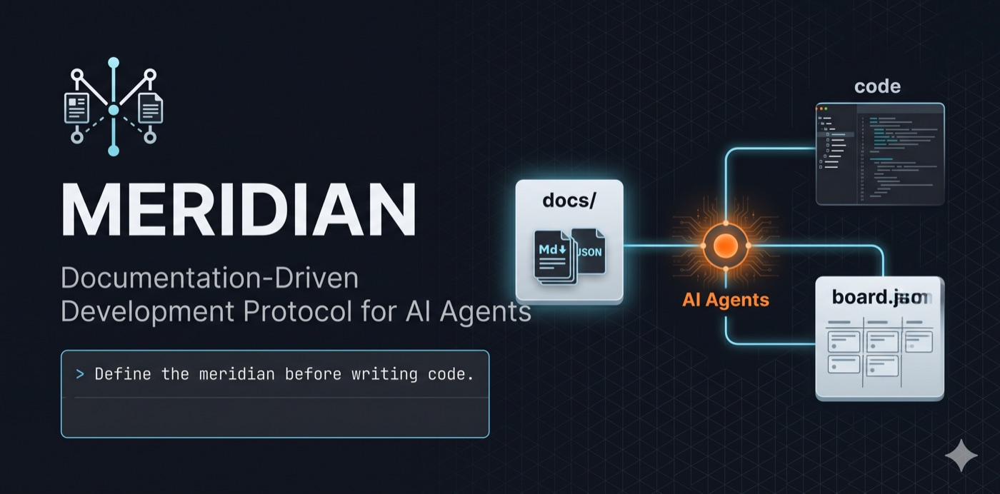

<p align="center">
  
</p>

<p align="center">
  <a href="LICENSE"></a>
  <a href=".github/workflows/ci.yml"></a>
  
</p>

<p align="center">
  <strong>I'm testing a repo-native harness for AI coding agents —<br />
  guides and sensors in Git, persistent task specs, and a Scrum-shaped loop I manage.</strong>
</p>

> Very early personal experiment. Rules, structure, and APIs will change.  
> [Full protocol](.agent/MERIDIAN.md)

# Meridian

## The hypothesis

AI agents in the IDE ship code fast — but without a written spec, scope drifts in chat, decisions get lost, and "done" means whatever the model said five messages ago.

**I'm testing another approach:** a thin harness layer on top of Cursor or Claude Code — phase docs in `docs/`, delivery in `.meridian/meridian.db`, `.agent/` for guides and workflows, validators as sensors. I plan the project and work solo with the agent, but I also want to see if it can run longer autonomous stretches on the open backlog without breaking the flow. Chat does not persist. Files do.

## What I'm learning

- Once versions, sprints, and open US are in **SQLite** (`.meridian/meridian.db`), can the agent run long continuous sessions on the backlog — refine, implement, close — without drifting or skipping harness gates?
- Does managing Scrum in files (commands, skills, structured artifacts) cost fewer credits than re-explaining context and priorities in chat every session?
- Does the harness — guides, sensors, `ready` / `Record` gates, phase docs — actually ship functional, organized, secure, **documented** software, not just fast code?

Still open questions. This repository is my lab.

## Repository lineage (Meridian 2.0)

| Branch / artifact | Purpose |
| ----------------- | ------- |
| `main` | Meridian 2.0 — delivery in `.meridian/meridian.db` + `delivery.json`; phase docs in `docs/` |
| `meridian-v1-old` | Meridian v1 — file-per-artifact Markdown under `docs/us/`, `docs/epics/`, etc. |

Cutover steps: [MERIDIAN_V2_CUTOVER.md](MERIDIAN_V2_CUTOVER.md). Legacy Markdown delivery → **`/migrate-delivery`** (or `migrate_md_to_sqlite.py`).

## The loop I'm testing

```
document → plan → refine → implement → close → commit
```

| Step | In one line |
| ---- | ----------- |
| **Document** | Scope, stack, security, architecture in `docs/00`–`11` — I approve, agent drafts |
| **Plan** | Epics, versions, sprint, and user stories in `.meridian/meridian.db` (phase docs in `docs/`) |
| **Refine** | Story gets a concrete Approach and `ready: true` before any product code |
| **Implement** | Agent reads the US and codes against acceptance criteria |
| **Close** | Agent fills `## Record` with evidence; I review and set `status: ✅` |
| **Commit** | One commit per closed story — code and docs together in Git |

**Two rules of the experiment:** no product code without `ready: true`. No ✅ without a filled `## Record`.

## Layers in a Meridian project

| Path | Role |
| ---- | ---- |
| **`docs/`** | Phase memory — scope, architecture, security (`00`–`11`); approved by you |
| **`.meridian/`** | Delivery runtime — `meridian.db` (gitignored) + `delivery.json` (connector config, commitável) |
| **`.agent/`** (from kit) | Guides — rules, agents, skills, slash workflows |
| **`app-visual-studio/`** (optional) | IDE board and deliverables — reads SQLite; not the harness itself |

Scrum-inspired, adapted for a **single human directing AI agents** — no story points, velocity, or mandatory Feature layer. [Scrum ↔ Meridian map](.agent/references/scrum-meridian-map.md)

## Try it now

```bash
git clone https://github.com/colabcolibri/meridian.git
cd meridian

# Cursor or Claude Code — generate local adapters (not committed):
chmod +x .agent/scripts/sync_cursor_kit.sh
./.agent/scripts/sync_cursor_kit.sh
```

1. In your IDE: `/init-meridian` — creates `docs/` + bootstraps `.meridian/` (`meridian.db` + `delivery.json`).
2. **`/agents-help`** — agent groups, slash commands, numbered steps (`.agent/references/agents-help.md`).
3. Optional: install the VS Code extension — `cd app-visual-studio && pnpm install && pnpm install:cursor`.
4. Anytime: `/status` — blockers, counts (`meridian_delivery.py`), suggested next step.

Agents call **`meridian_delivery.py`** for delivery (reads `.meridian/delivery.json`; default connector: sqlite).

**Use in another repo:** copy `.agent/` only, run `/init-meridian`, sync the kit if you use Cursor/Claude. Existing codebase → `docs/inventory/as-is.md`. Coming from v1 Markdown delivery → **`/migrate-delivery`** ([usage guide](.agent/references/usage-guide.md#migrate-an-existing-project)).

**Maintainers:** [instruction surfaces](.agent/references/instruction-surfaces.md) — where to edit when the protocol changes (kit, extension).

Or download a **kit release** (`.agent` only):

```bash
tar -xzf meridian-kit-1.0.0.tar.gz && cd meridian-kit-1.0.0
./install.sh /path/to/my-project
```

Build the tarball from this repo: `KIT_VERSION=1.0.0 ./.agent/scripts/package-kit.sh`

Full distribution guide (kit tarball + extension VSIX, GitHub Releases): [`.agent/DISTRIBUTION.md`](.agent/DISTRIBUTION.md)

**Kit install includes all agents** (`.agent/agents/`) plus skills, workflows, and rules. Cursor/Claude get slash commands via adapter sync; Antigravity uses `.agent/` only (`--no-sync`).

## Distribution (for others)

| Product | How users get it |
| ------- | ---------------- |
| **Meridian Harness** (kit + board) | [Visual Studio Marketplace](https://marketplace.visualstudio.com/items?itemName=colabcolibri.meridian-vscode) → **Meridian: Install Harness** in each project |

Publisher: **colabcolibri** · [GitHub](https://github.com/colabcolibri/meridian)

## What's in this repository

| Piece | Required? | Role in the experiment |
| ----- | --------- | ---------------------- |
| [`.agent/`](.agent/) | Yes (in your project) | Portable harness kit — guides, skills, validation |
| `docs/` | Yes (in your project) | Living spec — [example here](docs/) |
| [`app-visual-studio/`](app-visual-studio/) | No | VS Code/Cursor extension — board reads `.meridian/meridian.db` |

## Where the experiment stands

| Version | What | Status |
| ------- | ---- | ------ |
| **v4** | VS Code extension — board, versions, sprints, epics | Shipped |
| **v9** | SQLite delivery store + kit scripts | Shipped |
| **v10** | Remove browser monitor; dogfood `docs/` at repo root | Shipped |
| **v11** | Board só SQLite; facade `meridian_delivery.py` + `delivery.json` | Shipped |
| v5+ | Write commands, wizards | Planned |

Details in [`MERIDIAN_V2_CUTOVER.md`](MERIDIAN_V2_CUTOVER.md) and release rows in SQLite (`meridian_delivery.py list versions`) when dogfood DB exists.

## Reference (not the home page)

- [Protocol for agents](.agent/MERIDIAN.md)
- [How to use Meridian](.agent/references/how-to-use.md) — start here (extension vs chat, layering)
- [Concepts](.agent/references/start-here.md) · [Recipes](.agent/references/usage-guide.md) · [Command reference](.agent/references/agents-help.md)
- [Scrum ↔ Meridian map](.agent/references/scrum-meridian-map.md)
- [Validate a project](.agent/scripts/validate_meridian.py): `python3 .agent/scripts/validate_meridian.py . --sqlite-only`
- [Delivery CLI](.agent/references/templates/delivery-connector-schema.md): `python3 .agent/scripts/meridian_delivery.py counts`
- [IDE adapters](.agent/IDE_ADAPTERS.md) — Antigravity native; Cursor/Claude via sync script

## Contributing · license

[`CONTRIBUTING.md`](CONTRIBUTING.md) · [`SECURITY.md`](SECURITY.md) · [PolyForm Noncommercial 1.0.0](LICENSE)

Feedback and issues welcome — this is an open lab, not a finished product.
