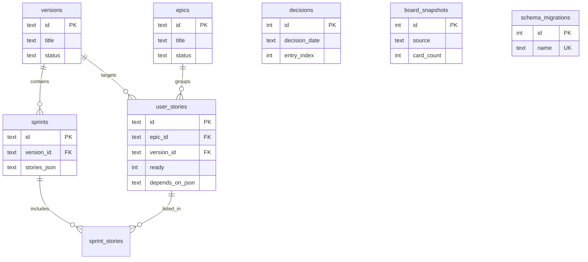

# 06 — Database

## Strategy

Meridian 2.0 stores **delivery artifacts** in a local **SQLite** database per product. **Phase documents** (`00`–`11`, discovery, architecture detail, inventory, templates) remain Markdown on disk — they are the project contract and gate documents agents read at init.

| Storage                              | Artifacts                                                                                                 |
| ------------------------------------ | --------------------------------------------------------------------------------------------------------- |
| **Markdown** (`docs/`)               | `00_scope.md` … `11_decisions.md`, `discovery/`, `architecture/`, `inventory/`, `templates/`, `README.md` |
| **SQLite** (`.meridian/meridian.db`) | epics, versions, sprints, user stories, decisions, board snapshots                                        |

Path: `{packageRoot}/.meridian/meridian.db` (e.g. `app-desktop/.meridian/meridian.db` in dogfood). Kit root `.meridian/projects.json` (multi-product manifest) stays separate.

Engine: SQLite 3 with WAL journal mode for concurrent monitor reads during kit writes.

## Schema overview

Migration: `.agent/migrations/20260718100000_initial_delivery_schema.sql`



### Tables

| Table               | Purpose                                                         |
| ------------------- | --------------------------------------------------------------- |
| `schema_migrations` | Applied kit migration filenames                                 |
| `versions`          | Release docs (v0, v1, …)                                        |
| `epics`             | Epic capability narratives                                      |
| `sprints`           | Sprint goals and scope                                          |
| `sprint_stories`    | Sprint ↔ US junction (ordered)                                  |
| `user_stories`      | US frontmatter + Intent/Plan/Record/Boundaries sections         |
| `decisions`         | Append-only decision log entries (from `docs/decisions/*.json`) |
| `board_snapshots`   | Derived `board.json` history (`source`: import \| generate)     |

User story section columns map to `section-contracts.md` (`intent_acceptance`, `plan_approach`, `record_files`, etc.). Full markdown body also stored in `body_markdown` for round-trip export.

## Bootstrap and migrations

```bash
python3 .agent/scripts/meridian_db.py migrate <package-root>
python3 .agent/scripts/meridian_db.py list-tables <package-root>
```

Kit module: `.agent/scripts/meridian_db.py` — `connect()`, `apply_migrations()`, `bootstrap()`, `resolve_db_path()`.

Migrations are versioned SQL files in `.agent/migrations/` with `YYYYMMDDHHMMSS_description.sql` naming. Re-run is idempotent (skips applied names in `schema_migrations`).

## Migration from Markdown (v1)

One-shot import: `.agent/scripts/migrate_md_to_sqlite.py` (US-0107, US-0108) reads legacy `docs/epics/`, `docs/versions/`, `docs/sprints/`, `docs/us/`, and `docs/decisions/` into SQLite. Source `.md` files may remain as read-only archive after cutover.

## Pending approval

- [ ] Manager approves this document (`status: approved`) after US-0113 review.
- [ ] `05_architecture.md` storage split section updated (US-0113).
