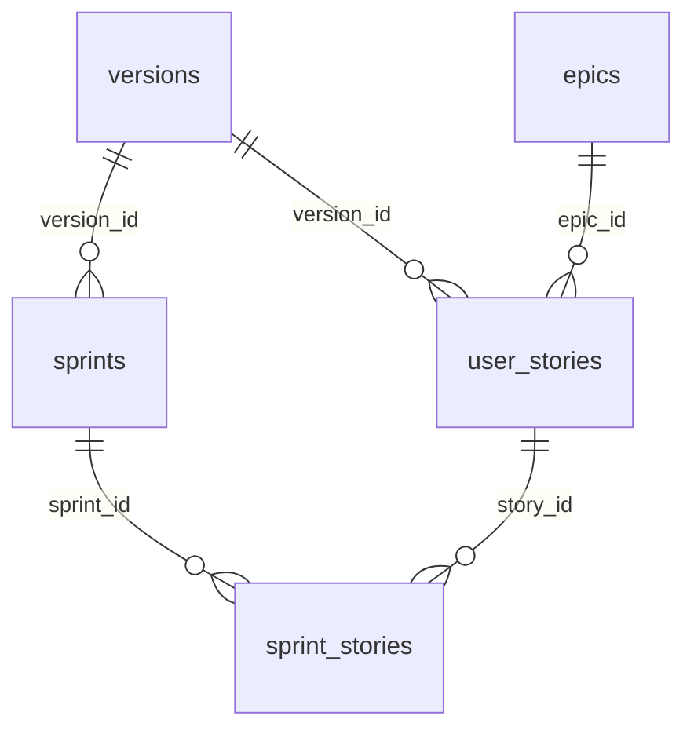

# 06 — Database

## Strategy

Meridian **v10+** stores **all delivery artifacts** in SQLite only. **Phase documents** (`00`–`11`, discovery, architecture detail, inventory, templates) remain Markdown — project gates and agent init context.

| Storage | Artifacts |
| ------- | --------- |
| **Markdown** (`docs/`) | `00_scope.md` … `11_decisions.md`, `discovery/`, `architecture/`, `inventory/`, `templates/`, `kanban/board.json` (derived) |
| **SQLite** (`.meridian/meridian.db`) | epics, versions, sprints, user stories, sprint_stories, decisions, board snapshots |

Path: `{packageRoot}/.meridian/meridian.db`. Agent reference: `.agent/references/templates/sqlite-delivery-operations.md`.

## Relational model

Foreign keys are enforced (`PRAGMA foreign_keys = ON`). **Insert order:**

1. `versions` → 2. `epics` → 3. `user_stories` (needs `epic_id`, `version_id`) → 4. `sprints` (needs `version_id`) → 5. `sprint_stories` (needs `sprint_id`, `story_id`)



### Summary column (progressive disclosure)

| Table | `summary` purpose |
| ----- | ----------------- |
| `user_stories` | 4–8 sentences after `/complete-us`; agents read before `body_markdown` |
| `epics`, `versions`, `sprints` | One-paragraph capability/release/sprint digest |

Workflow: `meridian_db_cli list` → `show ID` (summary) → `show ID --full` only when implementing.

## CLI — discover and write

```bash
python3 .agent/scripts/bootstrap_meridian_db.py .
python3 .agent/scripts/meridian_db_cli.py counts .
python3 .agent/scripts/meridian_db_cli.py list user_stories --version v10
python3 .agent/scripts/meridian_db_cli.py show US-0115
python3 .agent/scripts/meridian_db_cli.py show US-0115 --full
python3 .agent/scripts/meridian_db_cli.py search "parity"
python3 .agent/scripts/meridian_db_cli.py create-us --title "..." --epic EPIC-15 --version v10
python3 .agent/scripts/meridian_db_cli.py update-us US-0115 --from-file /tmp/us.md
python3 .agent/scripts/meridian_db_cli.py set-ready US-0115
python3 .agent/scripts/meridian_db_cli.py set-summary US-0115 --text "..."
```

Never `Write` on `docs/us/`, `docs/epics/`, `docs/versions/`, `docs/sprints/`, or `docs/decisions/*.json` when `meridian.db` exists.

## Migration and cutover

```bash
python3 .agent/scripts/migrate_md_to_sqlite.py .      # legacy import
python3 .agent/scripts/verify_md_sqlite_parity.py .   # gate — exit 0 required
python3 .agent/scripts/backfill_summaries.py .
python3 .agent/scripts/purge_delivery_md.py . --dry-run
python3 .agent/scripts/purge_delivery_md.py . --require-verify
python3 .agent/scripts/validate_meridian.py . --sqlite-only
python3 .agent/scripts/generate_board.py .
```

## Validation modes

| Flag | Behavior |
| ---- | -------- |
| _(default)_ | DB when `meridian.db` exists; phase docs on disk |
| `--md-only` | Legacy markdown delivery folders |
| `--sqlite-only` | Fails if delivery `.md`/`.json` still present |

## Kit modules

| Script | Role |
| ------ | ---- |
| `meridian_db.py` | `connect`, `upsert_*`, `export_planning_json`, migrations |
| `meridian_db_cli.py` | Human/agent query and write CLI |
| `meridian_db_export.py` | JSON for extension (`--format planning`) |
| `verify_md_sqlite_parity.py` | Pre-purge gate |
| `purge_delivery_md.py` | Remove legacy delivery files |
| `backfill_summaries.py` | Populate `summary` column |

Migrations: `.agent/migrations/YYYYMMDDHHMMSS_*.sql`
