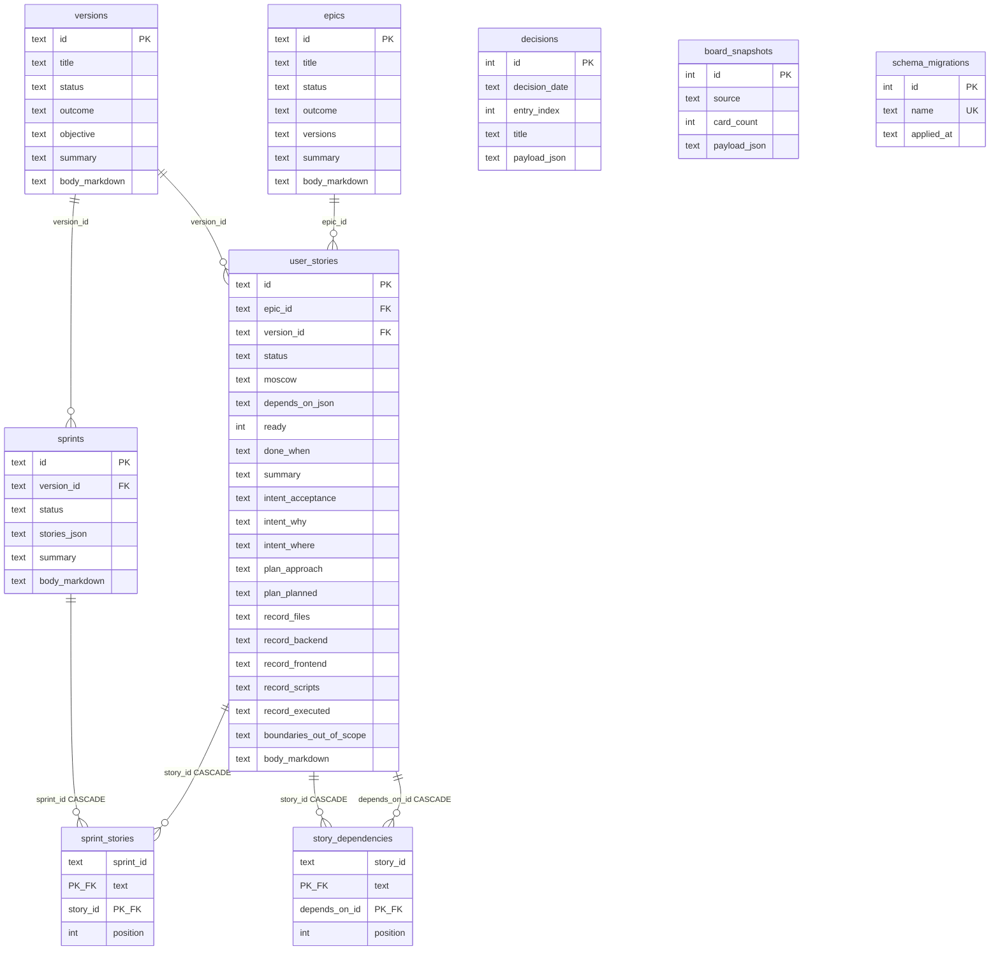

# 06 — Database

## Strategy

Meridian **v10+** stores **all delivery artifacts** in SQLite only. **Phase documents** (`00`–`11`, discovery, architecture detail, inventory, templates) remain Markdown — project gates and agent init context.

| Storage | Artifacts |
| ------- | --------- |
| **Markdown** (`docs/`) | `00_scope.md` … `11_decisions.md`, `discovery/`, `architecture/`, `inventory/` |
| **SQLite** (`.meridian/meridian.db`) | epics, versions, sprints, user stories, sprint_stories, story_dependencies, decisions, board_snapshots |

Path: `{packageRoot}/.meridian/meridian.db` (gitignored). Canonical SQL: `.agent/migrations/`. Agent upsert guide: `.agent/references/templates/sqlite-delivery-operations.md`. Section contract (markdown shape): `.agent/references/templates/section-contracts.md`.

## Dual storage — markdown + columns

Every delivery row (epic, version, sprint, user story) uses **two layers**:

| Layer | Column(s) | Purpose |
| ----- | --------- | ------- |
| **Canonical file** | `body_markdown` | Full Meridian markdown — frontmatter `---` + all `##` / `###` sections. Round-trip for display, export, extension click-to-open, validator. |
| **Parsed sections** | one TEXT column per `###` | Denormalized at upsert time by `meridian_markdown_parse.py` — query/search without re-parsing. |
| **Digest** | `summary` | 4–8 sentences after close; agents read before full body. |
| **Frontmatter** | dedicated columns | e.g. `epic_id`, `version_id`, `status`, `ready`, `depends_on_json` |

```txt
Agent writes full US markdown
        │
        ▼
meridian_delivery.py update-us --from-file us.md
        │
        ├─► body_markdown          (entire file — source for display)
        ├─► record_files, …        (each ### under ## Record → own column)
        ├─► intent_why, plan_approach, …
        └─► epic_id, status, ready, …
```

**Write rule:** always `update-us` with **complete markdown** — never UPDATE a single column without updating `body_markdown`. Kit keeps columns in sync on upsert.

**Read rule:** `show US-XXXX` (summary) → `show US-XXXX --full` (`body_markdown`). Validator and extension use virtual markdown from `body_markdown`, not isolated columns.

**Close rule (`/complete-us`):** fill `## Record` subsections in markdown (`### Files`, `### Backend`, …) per `implementation-template.md` — each becomes its column automatically.

## Schema — entity-relationship diagram

Foreign keys enforced (`PRAGMA foreign_keys = ON`). WAL journal mode for concurrent reads.



### Insert order (FK-safe)

```txt
1. versions          (no FK)
2. epics             (no FK; versions field is text JSON list, not FK)
3. user_stories      → epic_id, version_id
4. sprints           → version_id
5. sprint_stories    → sprint_id, story_id (rebuilt by upsert_sprint)
6. story_dependencies → story_id, depends_on_id (rebuilt by upsert_user_story; validates US PKs)
7. decisions         (independent)
8. board_snapshots   (audit JSON on upsert — `record_board_snapshot()`)
```

Breaking order causes `FOREIGN KEY constraint failed` — use `meridian_db.py` upsert helpers or `meridian_delivery.py`, not ad-hoc SQL.

## Tables — column contract

Migrations:

| File | Adds |
| ---- | ---- |
| `20260718100000_initial_delivery_schema.sql` | All tables below + indexes |
| `20260718110000_summary_columns.sql` | `summary TEXT` on versions, epics, sprints, user_stories |
| `20260718120000_story_dependencies.sql` | `story_dependencies` junction + backfill from `depends_on_json` |

### `versions`

| Column | Type | Notes |
| ------ | ---- | ----- |
| `id` | TEXT PK | e.g. `v10`, `v2.05` |
| `title`, `status`, `outcome` | TEXT | frontmatter + narrative |
| `objective`, `done_criteria`, `included`, `explicitly_out`, `go_live` | TEXT | parsed sections |
| `summary` | TEXT | progressive disclosure (v10) |
| `body_markdown` | TEXT | full file round-trip |

### `epics`

| Column | Type | Notes |
| ------ | ---- | ----- |
| `id` | TEXT PK | `EPIC-XX` |
| `title`, `status`, `outcome` | TEXT | frontmatter |
| `profiles`, `versions` | TEXT | YAML-list as string (not FK) |
| `capability`, `expected_outcome`, `out_of_scope`, `notes` | TEXT | parsed `##` sections |
| `summary`, `body_markdown` | TEXT | digest + full file |

### `user_stories`

Frontmatter maps to columns (`epic` → `epic_id`, `version` → `version_id`, `depends_on` → `depends_on_json` + `story_dependencies`).

| Column | Type | Notes |
| ------ | ---- | ----- |
| `id` | TEXT PK | `US-XXXX` |
| `title` | TEXT | from frontmatter |
| `epic_id` | TEXT FK → `epics.id` | required |
| `version_id` | TEXT FK → `versions.id` | required |
| `status`, `moscow`, `ready`, `done_when`, `tests`, `tests_status` | | frontmatter |
| `depends_on_json` | TEXT | denormalized JSON array; synced with `story_dependencies` |
| `summary` | TEXT | read first; 4–8 sentences after `/complete-us` |
| `body_markdown` | TEXT | **full US file** — canonical round-trip |
| `created_at`, `updated_at` | TEXT | auto |

#### Section columns — each `###` → one column

Filled on `update-us` by `meridian_markdown_parse.extract_us_sections()`.

| Parent `##` | Markdown `###` | Column |
| ----------- | ---------------- | ------ |
| Intent | Acceptance | `intent_acceptance` |
| Intent | Why | `intent_why` |
| Intent | Where | `intent_where` |
| Plan | Approach | `plan_approach` |
| Plan | Architecture refs | `plan_architecture_refs` |
| Plan | API / DB impact | `plan_api_db` |
| Plan | Security notes | `plan_security` |
| Plan | Related decisions | `plan_decisions` |
| Plan | Planned | `plan_planned` |
| **Record** | **Files** | `record_files` |
| **Record** | **Backend** | `record_backend` |
| **Record** | **Frontend** | `record_frontend` |
| **Record** | **Scripts / Docs** | `record_scripts` |
| **Record** | **Executed** | `record_executed` |
| Boundaries | Out of scope for this story | `boundaries_out_of_scope` |
| Boundaries | Notes | `boundaries_notes` |

On status `✅`, validator rejects placeholder `## Record` in `body_markdown`. Closed US must have real `record_files` and `record_executed` content.

```bash
sqlite3 .meridian/meridian.db "
  SELECT id, substr(record_files,1,80), substr(record_executed,1,80)
  FROM user_stories WHERE id='US-0001';
"
```

Indexes: `idx_user_stories_epic`, `idx_user_stories_version`.

### `story_dependencies`

| Column | Type | Notes |
| ------ | ---- | ----- |
| `story_id` | TEXT PK FK → `user_stories.id` | dependent story |
| `depends_on_id` | TEXT PK FK → `user_stories.id` | prerequisite US PK (`US-XXXX`) |
| `position` | INTEGER | order in frontmatter list |

Rebuilt on every `upsert_user_story`. Validates: PK format, target exists, no self-reference, no cycles. `/implement-us` requires each dependency `status: ✅`.

```bash
sqlite3 .meridian/meridian.db "
  SELECT sd.story_id, sd.depends_on_id, us.status
  FROM story_dependencies sd
  JOIN user_stories us ON us.id = sd.depends_on_id
  WHERE sd.story_id = 'US-0128';
"
```

### `sprints`

| Column | Type | Notes |
| ------ | ---- | ----- |
| `id` | TEXT PK | e.g. `v10-S1` |
| `version_id` | TEXT FK → `versions.id` | required |
| `stories_json` | TEXT | JSON array; must match `sprint_stories` rows |
| `goal`, `done_when`, `goal_body`, `scope_table`, … | TEXT | |
| `summary`, `body_markdown` | TEXT | |

Index: `idx_sprints_version`.

### `sprint_stories` (junction)

| Column | Type | Notes |
| ------ | ---- | ----- |
| `sprint_id` | TEXT FK → `sprints.id` ON DELETE CASCADE | |
| `story_id` | TEXT FK → `user_stories.id` ON DELETE CASCADE | |
| `position` | INTEGER | sprint priority order |

Composite PK `(sprint_id, story_id)`. Not every US appears here — only US assigned to a sprint.

### `decisions`

| Column | Type | Notes |
| ------ | ---- | ----- |
| `decision_date` | TEXT | `YYYY-MM-DD` |
| `entry_index` | INTEGER | order within day |
| `payload_json` | TEXT | full decision entry JSON |
| UNIQUE | `(decision_date, entry_index)` | |

### `board_snapshots`

Append-only kanban card payloads (`source`: `import` | `upsert`). v11 no longer writes `docs/kanban/board.json`.

### `schema_migrations`

Applied migration filenames — bootstrap skips already-applied SQL files.

## Dogfood reference counts (v10 cutover)

Illustrative after migration + purge on this repo (local DB, not in git):

| Table | Count |
| ----- | ----- |
| `versions` | 16 |
| `epics` | 15 |
| `sprints` | 44 |
| `user_stories` | 125 |
| `sprint_stories` | 96 |
| `decisions` | 63 |

Verify live: `python3 .agent/scripts/meridian_delivery.py counts .`

Note: US numbering skips `US-0096` (never existed in v1 tree).

## Integrity checks

```bash
# row counts
python3 .agent/scripts/meridian_delivery.py counts .

# FK orphans (should print nothing)
sqlite3 .meridian/meridian.db "
  SELECT 'orphan epic' WHERE EXISTS (
    SELECT 1 FROM user_stories WHERE epic_id NOT IN (SELECT id FROM epics));
  SELECT id, epic_id FROM user_stories WHERE epic_id NOT IN (SELECT id FROM epics);
"

# sprint junction vs stories_json (kit verify script)
python3 .agent/scripts/validate_meridian.py . --sqlite-only
```

## Extension and export

| Consumer | Mechanism | Data |
| -------- | --------- | ---- |
| Board / planning lists | `meridian_db_export.py --format planning` | Structured JSON (no `body_markdown` in payload) |
| Click-to-open artifact | `meridian_db_export.py --entity us --id US-XXXX` | Single `body_markdown` row |
| Structured edit (form) | `meridian_db_export.py --format form` / `--write-form` | JSON fields → build markdown → validate → upsert |
| Board audit | `record_board_snapshot()` on upsert | Optional history in `board_snapshots` |

Extension: **View** = HTML preview; **Edit** = schema-driven form (all entity types); **Advanced** = raw markdown with confirm.

## Summary column (progressive disclosure)

| Table | `summary` purpose |
| ----- | ----------------- |
| `user_stories` | 4–8 sentences after `/complete-us`; agents read before `body_markdown` |
| `epics`, `versions`, `sprints` | One-paragraph digest |

Workflow: `meridian_delivery.py list` → `show ID` (summary) → `show ID --full` only when implementing.

## CLI — discover and write

```bash
python3 .agent/scripts/bootstrap_meridian_db.py .
python3 .agent/scripts/meridian_delivery.py counts .
python3 .agent/scripts/meridian_delivery.py list user_stories --version v10
python3 .agent/scripts/meridian_delivery.py show US-0115
python3 .agent/scripts/meridian_delivery.py show US-0115 --full
python3 .agent/scripts/meridian_delivery.py search "parity"
python3 .agent/scripts/meridian_delivery.py create-us --title "..." --epic EPIC-15 --version v10
python3 .agent/scripts/meridian_delivery.py update-us US-0115 --from-file /tmp/us.md
python3 .agent/scripts/meridian_delivery.py set-ready US-0115
python3 .agent/scripts/meridian_delivery.py set-summary US-0115 --text "..."
python3 .agent/scripts/meridian_delivery.py prepend-decision \
  --date "$(date +"%Y-%m-%d")" --time "$(date +"%H:%M")" \
  --title "..." --affected-document "docs/05_architecture.md" \
  --what-changed "..." --why-changed "..." --impact "..." --responsible "..."
```

Never `Write` on `docs/us/`, `docs/epics/`, `docs/versions/`, `docs/sprints/`, or `docs/decisions/*.json` when `meridian.db` exists. Use `prepend-decision` for the decision log.

## Migration and cutover

```bash
python3 .agent/scripts/migrate_md_to_sqlite.py .      # legacy import (from meridian-v1-old branch)
python3 .agent/scripts/verify_md_sqlite_parity.py .   # gate — exit 0 required
python3 .agent/scripts/backfill_summaries.py .
python3 .agent/scripts/purge_delivery_md.py . --dry-run
python3 .agent/scripts/purge_delivery_md.py . --require-verify
python3 .agent/scripts/validate_meridian.py . --sqlite-only
```

Fresh clone: `bootstrap` creates empty schema; import data via `migrate_md_to_sqlite` from legacy branch or restore a DB backup.

## Validation modes

| Flag | Behavior |
| ---- | -------- |
| _(default)_ | DB when `meridian.db` exists; phase docs on disk |
| `--md-only` | Legacy markdown delivery folders |
| `--sqlite-only` | Fails if delivery `.md`/`.json` still present |

## Kit modules

| Script | Role |
| ------ | ---- |
| `meridian_db.py` | `connect`, `upsert_*`, `export_planning_json`, migrations |
| `meridian_delivery.py` | Human/agent query and write CLI |
| `meridian_db_export.py` | JSON for extension (`--format planning`; `--format form`; `--write-form`) |
| `meridian_delivery_form.py` | Build markdown from form fields; validate before upsert |
| `verify_md_sqlite_parity.py` | Pre-purge gate |
| `purge_delivery_md.py` | Remove legacy delivery files |
| `backfill_summaries.py` | Populate `summary` column |

Migrations: `.agent/migrations/YYYYMMDDHHMMSS_*.sql`
