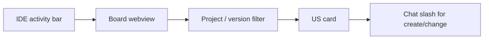

# 09 — Design system (Meridian Harness)

## Overview

- **Surfaces:** VS Code / Cursor extension webviews — Board, Epics, Versions, Sprints, Deliverables, kit help panels — **and** the kit HTML monitor (`.agent/board-ui/`).
- **Primary UI stack (extension):** `ts-shadcn` per `01_tech_stack.md` for new React UI; **runtime theme** inherits VS Code semantic colors in existing webviews.
- **Kit HTML stack:** static CSS tokens in `board-ui/css/tokens.css` (not `--vscode-*`). Same mood: work tool, not marketing.
- **Mood:** Work tool — moderate density, clear hierarchy, no marketing chrome (aligned with `04_principles.md` § Visual decision).

## Colors

Extension webviews map to VS Code theme tokens (do not hardcode hex in webview CSS).

| Token (semantic) | Role | VS Code variable |
| ---------------- | ---- | ---------------- |
| background | Page / editor canvas | `--vscode-editor-background` |
| foreground | Primary text | `--vscode-foreground` |
| surface | Sidebars, blocks | `--vscode-sideBar-background` |
| border | Dividers, cards | `--vscode-panel-border` |
| primary action | Buttons, active chips | `--vscode-button-background` / `--vscode-button-foreground` |
| link | IDs, navigation | `--vscode-textLink-foreground` |
| muted | Meta, descriptions | `--vscode-descriptionForeground` |
| focus | Focus ring | `--vscode-focusBorder` |
| success | Done progress | `--vscode-testing-iconPassed` |

**Theme files:** `app-visual-studio/src/webview-common.ts`, `markdown-content-styles.ts`, per-panel `*-webview-html.ts`.

## Typography

| Level | Use | Implementation |
| ----- | --- | -------------- |
| body | Default UI | `var(--vscode-font-family)`, `var(--vscode-font-size)` |
| h1 / h2 | Section titles in markdown viewers | `.content h1`, `.content h2` in `markdown-content-styles.ts` |
| meta | IDs, counts, chips | 10–11px, `descriptionForeground` |
| code | Inline / blocks | `var(--vscode-editor-font-family)`, `textCodeBlock-background` |

_Ramp: do not add a fourth body size. Host font size wins for body. `/design-theme`._

## Theme modes

| Mode | When it applies | Token set / file |
| ---- | --------------- | ---------------- |
| host | Extension webviews | `--vscode-*` via `webview-common.ts` |
| kit-html | `.agent/board-ui/` (not a webview) | `board-ui/css/tokens.css` — independent of editor theme |

Same semantic roles (canvas, foreground, border, primary, muted, focus). Do not hardcode a light-only palette in webviews.

## Screen flows

Jobs for the manager in the harness. Chrome is the **host** (activity bar / tabs). In-view toolbars wrap; they are not a second app shell.

| Flow | Surfaces | Entry | Empty | Error | Exit |
| ---- | -------- | ----- | ----- | ----- | ---- |
| Review delivery board | Extension webview, kit HTML | Command **Open Board** / `python3 .agent/board` | Columns with no cards in that filter — still show column headers | DB/export fail — message in webview, not a blank canvas | Switch view or close panel |
| Inspect epic / version / sprint | Extension webviews | Sidebar commands | Empty list + create via **chat** slash (not in-webview create) | Same as board | Back to list / close |
| Read kit help | Extension help panels | Commands sidebar | n/a (static md) | Missing kit files — installer path | Close editor |
| Filter by project (monorepo) | Board toolbar | Project dropdown | n/a | Missing `projects.json` — single product | Persist selection |

Do not clone a marketing landing into webviews. `/design-flow`.

## Layout

- **Spacing:** 4px rhythm (8, 12, 16, 20, 24px margins in webview-common).
- **Container:** Full webview width; `overflow-x: auto` on tables (`.table-wrap`).
- **Toolbar:** Project context strip + filters — single row, wrap on narrow widths.
- **Kit HTML monitor:** `html, body` use `height: 100dvh` (fallback `100vh`) and `overflow: hidden`. Header is `flex-shrink: 0`. `#view-root.view-board` is a flex column with `min-height: 0` (kanban track scrolls inside columns, not the page). List views scroll in `#view-root`. Filter and entity detail are overlay sheets, not a persistent inspector.

## Elevation and depth

Flat — hierarchy via background contrast (`sideBar-background` vs `editor-background`) and 1px borders, not drop shadows.

## Shapes

- **Border radius:** 4px chips/inputs; 8px cards, tables, code blocks.

## Components

- **Primitives (read-only):** VS Code webview API + shared classes in `webview-common.ts` — extend via new classes, do not fork VS Code.
- **Future shadcn primitives:** `app-visual-studio/src/components/ui/` when added via CLI — **read-only** after install.
- **Composed templates (target):** `app-visual-studio/src/components/app/` — `AppDialog`, `AppPageHeader`, `AppKanbanCard`, etc.
- **Composition:** config-driven props (`title`, `description`, `body`, `footer`, `variant`).

### Inventory (current → target)

| Surface | Location | Showcase |
| ------- | -------- | -------- |
| Kanban card | `board-webview-html.ts` **and** `.agent/board-ui/` (read-only) | Columns derived; cards show id/title/epic |
| Planning toolbar | `webview-project-context.ts` + common CSS | planned |
| Markdown viewer | `delivery-viewer-html.ts` + `markdown-content-styles.ts` | planned |
| Accordion block | `webview-common.ts` `.block` | planned |

## Do's and don'ts

- Do use `--vscode-*` variables for colors in webviews.
- Do extract repeated webview markup into composed templates when touching UI US.
- Do run `/design-flow` / `/design-theme` when adding a surface or mode.
- Do run `/design-review` before closing Must UI US.
- Don't hardcode light/dark colors — respect editor theme.
- Don't edit shadcn `ui/*` primitives for product copy or layout.
- Don't increase horizontal overflow on mobile-width webviews.
- Don't use `--vscode-*` in `.agent/board-ui/` (not a webview). Don't introduce a second `100vh` on `body` in view CSS.

## Responsive behavior

| Context | Rule |
| ------- | ---- |
| Narrow webview | Toolbar chips wrap; tables scroll inside `.table-wrap` |
| Kit HTML ≤768px | Inspector becomes a bottom sheet; header stays visible |
| Kit HTML ≤480px | One board column at a time; no `overflow-x` on `body` |
| Touch | Chip/button hit area ≥ 28px height (prefer 32px for new controls) |

## Accessibility baseline

- Focus visible via `--vscode-focusBorder` on interactive elements.
- Contrast: inherit VS Code theme (AA assumed for built-in themes).
- Keyboard: webview buttons and links reachable; no keyboard traps in accordions.
- Status badges: not color-only — include text/symbol (❌/🔶/✅/🧊/🚫 on forms; board headers use 📋/📌 for Backlog/Todo).

## Showcase catalog

| Route / artifact | Contents | Status |
| ---------------- | -------- | ------ |
| `media/design-catalog.html` (planned) | Token swatches + component states | planned — US via `/design-showcase` |
| Kit `09` (this file) | Contract for agents | active |

## Gate

Manager sets `status: approved` after reviewing this doc and first `/design-review` pass on Board webview.
