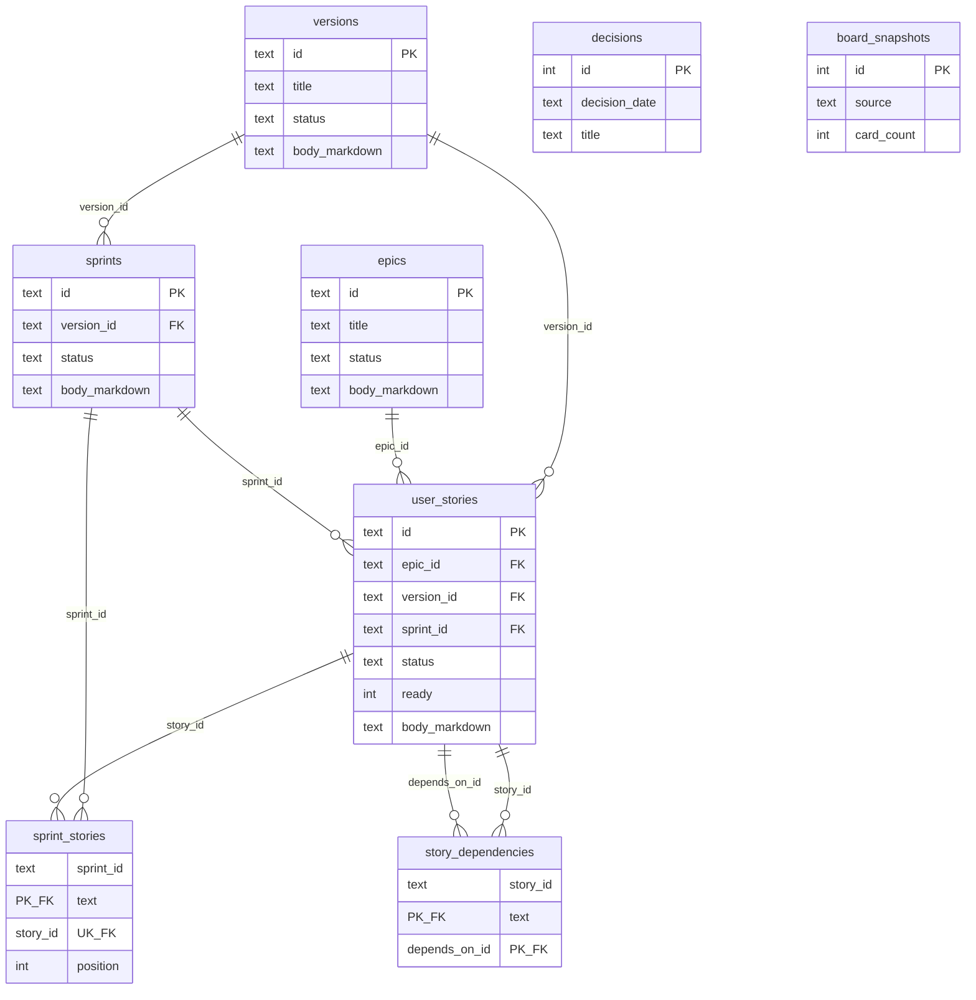

# Meridian delivery store

Companion ER for the IDE viewer. Full column contract: `docs/06_database.md` § Schema.

```mermaid
erDiagram
  versions ||--o{ user_stories : version_id
  epics ||--o{ user_stories : epic_id
  versions ||--o{ sprints : version_id
  sprints ||--o{ user_stories : sprint_id
  sprints ||--o{ sprint_stories : sprint_id
  user_stories ||--o{ sprint_stories : story_id
  user_stories ||--o{ story_dependencies : story_id
  user_stories ||--o{ story_dependencies : depends_on_id

  versions {
    text id PK
    text title
    text status
    text body_markdown
  }

  epics {
    text id PK
    text title
    text status
    text body_markdown
  }

  sprints {
    text id PK
    text version_id FK
    text status
    text body_markdown
  }

  user_stories {
    text id PK
    text epic_id FK
    text version_id FK
    text sprint_id FK
    text status
    int ready
    text body_markdown
  }

  sprint_stories {
    text sprint_id PK_FK
    text story_id UK_FK
    int position
  }

  story_dependencies {
    text story_id PK_FK
    text depends_on_id PK_FK
  }

  decisions {
    int id PK
    text decision_date
    text title
  }

  board_snapshots {
    int id PK
    text source
    int card_count
  }
```
