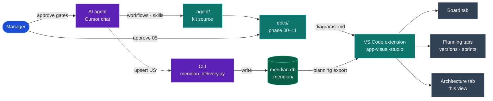

# Meridian runtime

```mermaid
flowchart LR
  human([Manager])
  agent[AI agent<br/>Cursor chat]
  kit[".agent/<br/>kit source"]
  docs["docs/<br/>phase 00–11"]
  cli[CLI<br/>meridian_delivery.py]
  sqlite[("meridian.db<br/>.meridian/")]
  ext[VS Code extension<br/>app-visual-studio]
  board[Board tab]
  planning[Planning tabs<br/>versions · sprints]
  arch[Architecture tab<br/>this view]

  human -->|approve gates| agent
  agent -->|workflows · skills| kit
  kit --> docs
  agent -.->|upsert US| cli
  cli -->|write| sqlite
  docs -->|diagrams .md| ext
  sqlite -->|planning export| ext
  ext --> board
  ext --> planning
  ext --> arch
  human -->|approve 05| docs

  classDef person fill:#1d4ed8,stroke:#93c5fd,color:#eff6ff
  classDef store fill:#065f46,stroke:#34d399,color:#ecfdf5
  classDef module fill:#0f766e,stroke:#2dd4bf,color:#ecfeff
  classDef workflow fill:#5b21b6,stroke:#c4b5fd,color:#f5f3ff
  classDef ui fill:#334155,stroke:#94a3b8,color:#f8fafc

  class human person
  class agent workflow
  class kit,docs,ext module
  class cli workflow
  class sqlite store
  class board,planning,arch ui
```
